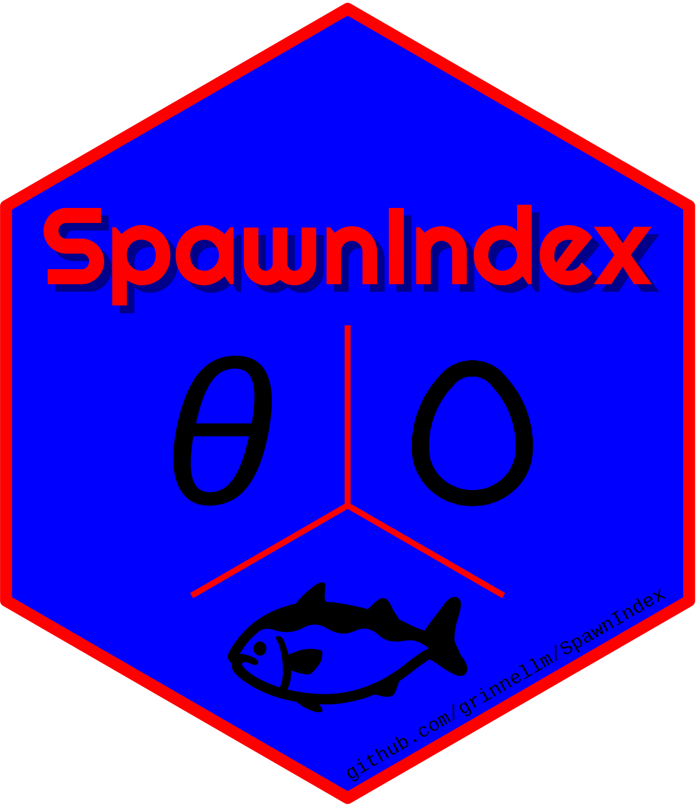

<!-- README.md is generated from README.Rmd. Please edit that file. -->

# SpawnIndex 

Calculate the spawn index for Pacific Herring (*Clupea pallasii*) in
British Columbia, Canada.

```{r version, echo = FALSE}
version <- as.vector(read.dcf('DESCRIPTION')[, 'Version'])
```

<!-- badges: start -->
[](https://github.com/grinnellm/SpawnIndex/actions)
[](https://codecov.io/gh/grinnellm/SpawnIndex)
[](https://github.com/grinnellm/SpawnIndex/actions)
[](commits/master)
[](https://CRAN.R-project.org/package=SpawnIndex)
<!-- badges: end -->

Note: `R-CMD-check` works on my Windows machine but fails on GitHub Actions
(see [#30](https://github.com/grinnellm/SpawnIndex/issues/30)).

## Description

The SpawnIndex package provides data, parameter values, and methods to
calculate the spawn index for Pacific Herring (*Clupea pallasii*) in
British Columbia (BC), Canada. Essentially, spawn index calculations convert
spawn survey observations (e.g., spawn extent, number of egg layers,
substrate type) to the Pacific Herring spawn index in BC. There are three
types of spawn survey observations: surface spawn observations, Macrocystis
spawn observations, and understory spawn observations. In addition, we
include methods to convert eggs to biomass, and estimate spawning biomass in
spawn-on-kelp operations. Note that the 'spawn index' is a relative index of
spawning biomass.

## Installation

Install the SpawnIndex package from [GitHub](https://github.com/) with:

```{r install, eval = FALSE}
# install.packages("devtools")
devtools::install_github(repo = "grinnellm/SpawnIndex")
```

## Examples

We show two example calculations:
surface spawn index, and
spawn-on-kelp biomass.

### Surface spawn index

This example shows how to calculate
the spawn index for a surface spawn survey.
First, load the SpawnIndex package in the usual way.

```{r load}
library(SpawnIndex)
```

Next, load the default parameter values for spawn index calculations, 
and calculate the conversion factor for the number of Pacific Herring eggs
to the spawn index (i.e., biomass in tonnes, t).
Call the function with the default parameters.

```{r theta}
data(pars)
theta <- eggs_to_sb()
theta
```

Thus, convert eggs to the spawn index in tonnes by
dividing the number of eggs by `r ifelse(theta == 1e+08, "10^8^", theta)`,
where `theta` is in units of 10^8^\ eggs\ t^-1^.
Then, calculate egg density for a given number of egg layers.

```{r surface_density}
layers <- 4
egg_density <- dens_surf(egg_layers = layers)
egg_density
```

In this example,
spawn surveyors observed `r layers` layers of Pacific Herring eggs,
which has an estimated egg density of `r egg_density`,
where egg density is in units of 10^3^\ eggs\ m^-2^.
Next, determine the total number of eggs in a given area.

```{r surface_eggs}
length <- 100
width <- 10
eggs <- egg_density * length * width
eggs
```

An area measuring `r length`\ m in length and `r width`\ m in width, 
covered with `r layers` layers of eggs,
has an estimated `r format(eggs, big.mark=",", scientific = FALSE)` 10^3^\ eggs.
Like egg density above, number of eggs is in 10^3^\ eggs.
Finally, calculate the spawn index for the spawn.

```{r surface_index}
index <- eggs * 1000 / theta
index
```

The estimated spawn index for this surface spawn survey is
`r format(index, digits=3)`\ t.

### Spawn-on-kelp biomass

This example shows how to calculate
the biomass of Pacific Herring that spawned and produced eggs
which were removed from the population by a spawn-on-kelp (SOK) fishery.
Use `theta` from above to estimate the biomass of
Pacific Herring that produced a given amount of SOK product in kilograms, kg.

```{r sok}
sok <- 100
biomass <- calc_sok_sb(sok = sok, theta = theta)
biomass
```

In this example, `r sok`\ kg of SOK was produced by
`r format(biomass, digits = 3)`\ t of spawning Pacific Herring.

## Additional information

The technical report has background information on the spawn index and calculations.
A draft technical report is available here: `./tr/Draft.pdf`.
**Please do not cite or circulate this draft.**
In addition, there is a vignette with an example workflow;
build the vignette

```{r vignette, eval = FALSE}
devtools::build_vignettes(pkg = ".")
```

and open the file `./doc/Introduction.html`.
