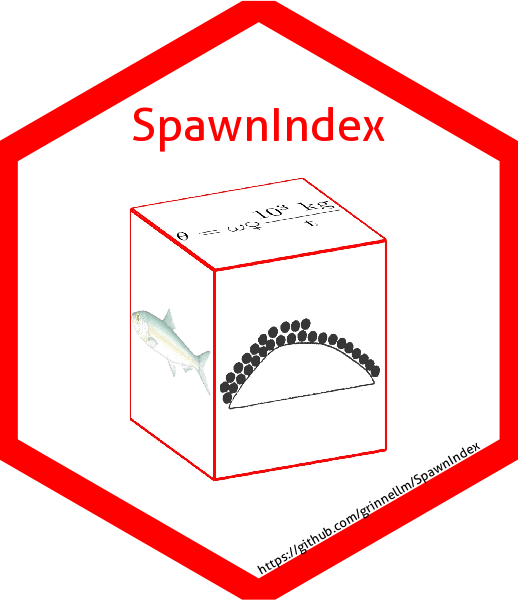

# SpawnIndex 

> Calculate the spawn index for Pacific Herring (*Clupea pallasii*) in British Columbia, Canada.

## Abstract

The spawn index time series is one component of Pacific Herring (*Clupea pallasii*) stock assessments in British Columbia, Canada.
This document describes how we calculate the spawn index from spawn survey observations (e.g., spawn extent, number of egg layers, substrate type).
There are three types of spawn survey observations:
(1) observations of spawn taken from the surface usually at low tide;
(2) underwater observations of spawn on giant kelp, Macrocystis (*Macrocystis* spp.); and
(3) underwater observations of spawn on other types of algae and the substrate, which we refer to as `understory.'
We calculate the spawn index in four steps.
First, we develop a statistical framework and sampling protocol to estimate the number of eggs in a given area.
Second, we develop a conversion factor to convert Pacific Herring eggs to biomass, which is critical to calculating the spawn index.
Third, we calculate the spawn index for each of the three aforementioned spawn survey types: surface, Macrocystis, and understory.
Finally, we combine the spawn indices from the three types of survey observations, and
aggregate by stock assessment region and year to produce a relative index of combined sex spawning biomass.
We identify uncertainties in spawn index calculations, and
describe how users can install the **R** package to calculate the spawn index using an example database.
Although we transform the spawn survey data from egg density to biomass in tonnes, the annual time series of egg density and biomass are relative indices of spawning biomass.

## Download and install

Download and install the package as follows:

`devtools::install_github(repo = "grinnellm/SpawnIndex")`.

## Additional information

The technical report has background information on the spawn index and calculations.
A draft technical report is available here: "./tr/Draft.pdf".
Please do not cite or circulate this draft.
The vignette has an example workflow; build the vignette like so:

`build_vignettes(pkg = ".")`

and open the file "./doc/Introduction.html".
