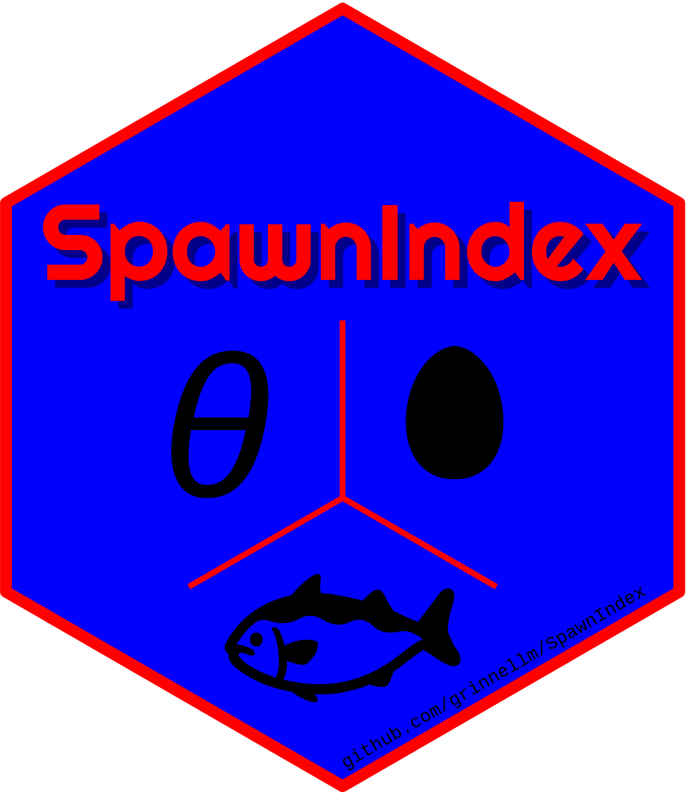

<!-- README.md is generated from README.Rmd; please edit README.Rmd. -->

# SpawnIndex 

Calculate the spawn index for Pacific Herring (*Clupea pallasii*) in
British Columbia, Canada.

<!-- badges: start -->

[](https://github.com/grinnellm/SpawnIndex/actions)
[](https://codecov.io/gh/grinnellm/SpawnIndex)
[](https://github.com/grinnellm/SpawnIndex/actions)
[](commits/master)
[](https://CRAN.R-project.org/package=SpawnIndex)
[](https://lifecycle.r-lib.org/articles/stages.html#stable)
<!-- badges: end -->

Note that `R-CMD-check` succeeds on my Windows machine but fails on
GitHub Actions (see [issue
\#30](https://github.com/grinnellm/SpawnIndex/issues/30)).

## Description

The SpawnIndex package provides data, parameters, and methods to
calculate the spawn index for Pacific Herring (*Clupea pallasii*) in
British Columbia, Canada. Essentially, spawn index calculations convert
spawn survey observations (e.g., spatial extent, number of egg layers,
substrate type) to the Pacific Herring spawn index. There are three
types of spawn survey observations: surface observations, Macrocystis
observations, and understory observations. In addition, we include
methods to convert eggs to biomass, and estimate spawning biomass in
spawn-on-kelp operations. Note that the ‘spawn index’ is a relative
index of spawning biomass.

## Installation

Install the SpawnIndex package from
[GitHub](https://github.com/grinnellm/SpawnIndex) with:

``` r
# install.packages("devtools")
devtools::install_github(repo = "grinnellm/SpawnIndex")
```

## Examples

We show two example calculations: surface spawn index, and spawn-on-kelp
biomass.

### Surface spawn index

This example shows how to calculate the spawn index for a surface spawn
survey. First, load the SpawnIndex package in the usual way.

``` r
library(SpawnIndex)
```

    ## This is SpawnIndex version 0.3.2.

Next, load the default parameter values for spawn index calculations,
and calculate the conversion factor for the number of Pacific Herring
eggs to the spawn index (i.e., biomass in tonnes, t). Call the function
with the default parameters.

``` r
data(pars)
theta <- eggs_to_sb()
theta
```

    ## [1] 1e+08

Thus, convert eggs to the spawn index in tonnes by dividing the number
of eggs by 10<sup>8</sup>, where `theta` is in units of
10<sup>8</sup> eggs t<sup>-1</sup>. Then, calculate egg density for a
given number of egg layers.

``` r
layers <- 4
egg_density <- dens_surf(egg_layers = layers)
egg_density
```

    ## [1] 863.57

In this example, spawn surveyors observed 4 layers of Pacific Herring
eggs, which has an estimated egg density of 863.57, where egg density is
in units of 10<sup>3</sup> eggs m<sup>-2</sup>. Next, determine the
total number of eggs in a given area.

``` r
length <- 100
width <- 10
eggs <- egg_density * length * width
eggs
```

    ## [1] 863570

An area measuring 100 m in length and 10 m in width, covered with 4
layers of eggs, has an estimated 863,570 10<sup>3</sup> eggs. Like egg
density above, number of eggs is in 10<sup>3</sup> eggs. Finally,
calculate the spawn index for the spawn.

``` r
index <- eggs * 1000 / theta
index
```

    ## [1] 8.6357

The estimated spawn index for this surface spawn survey is 8.64 t.

### Spawn-on-kelp biomass

This example shows how to calculate the biomass of Pacific Herring that
spawned and produced eggs which were removed from the population by a
spawn-on-kelp (SOK) fishery. Use `theta` from above to estimate the
biomass of Pacific Herring that produced a given amount of SOK product
in kilograms, kg.

``` r
sok <- 100
biomass <- calc_sok_index(sok = sok, theta = theta)
biomass
```

    ## [1] 0.3266324

In this example, 100 kg of SOK was produced by 0.327 t of spawning
Pacific Herring.

## Additional information

The technical report has background information on the spawn index and
calculations. A draft technical report is available here:
`./tr/Draft.pdf`. **Please do not cite or circulate this draft.** Build
the manual

``` r
devtools::build_manual(pkg = ".", path = here("doc"))
```

and open the file `./doc/SpawnIndex_0.3.2.pdf`. In addition, there is a
vignette with an example workflow; build the vignette

``` r
devtools::build_vignettes(pkg = ".")
```

and open the file `./doc/Introduction.html`.

## Contributing

If you would like to contribute to this project, please start by reading
the [guide to contributing](CONTRIBUTING.md). This applies to bug
reports, documentation, feature requests, mistakes, and other issues.
Note that this project is released with a [contributor code of
conduct](CONDUCT.md). By participating in this project you agree to
abide by its terms.
